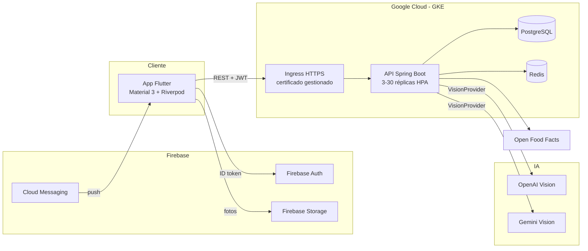

# Documento de Arquitectura — NutriScan AI

## 1. Visión general



## 2. Backend — Clean Architecture

```
ai.nutriscan
├── domain/          # núcleo: entidades, puertos (sin dependencias de framework web/IA)
│   ├── model/       # User, Meal, MealItem, WaterLog, WeightLog, ChatMessage, Subscription
│   ├── repository/  # puertos de persistencia (Spring Data JPA)
│   └── ai/          # puertos de IA: VisionProvider, NutritionAssistant
├── application/     # casos de uso
│   ├── service/     # AuthService, MealService, StatsService, ChatService...
│   └── dto/         # records de entrada/salida validados
├── infrastructure/  # adaptadores
│   ├── security/    # JwtService, JwtAuthFilter, SecurityConfig
│   ├── firebase/    # verificación de ID tokens
│   ├── ai/          # OpenAiVisionProvider, GeminiVisionProvider, OpenAiAssistant
│   ├── barcode/     # OpenFoodFactsClient (cacheado en Redis)
│   └── cache/       # RedisCacheManager
└── web/             # controladores REST + manejo global de errores + OpenAPI
```

**Regla de dependencias**: `web → application → domain ← infrastructure`. El dominio no conoce HTTP, JPA-implementación ni proveedores de IA concretos.

### Patrones aplicados
| Patrón | Dónde |
|---|---|
| Repository | `domain/repository` (puertos) + Spring Data (adaptador) |
| Strategy / Ports & Adapters | `VisionProvider` con implementaciones OpenAI/Gemini seleccionables por configuración |
| Dependency Injection | Constructor injection en todos los servicios (Spring) |
| DTO | records inmutables con Bean Validation |
| Cache-Aside | consulta de códigos de barras (`@Cacheable` en Redis) |

## 3. Frontend — Clean Architecture + MVVM

```
lib/
├── core/            # transversal: tema, rutas, red (Dio+JWT), modelos, sesión
└── features/<f>/    # una carpeta por funcionalidad
    └── presentation # View (widgets) + ViewModel (Notifier/AsyncNotifier de Riverpod)
```

- **View** = widgets sin lógica de negocio.
- **ViewModel** = `Notifier`/`AsyncNotifier` (Riverpod): estado inmutable + acciones.
- **Model/Data** = repositorios (`core/network/repositories.dart`) que encapsulan la API.

## 4. Decisiones de arquitectura (ADR resumidas)

| # | Decisión | Justificación |
|---|---|---|
| 1 | JWT propio en lugar de validar Firebase token en cada request | Evita latencia/costos de verificación por request; el backend controla expiración y claims (premium) |
| 2 | Proveedor de visión detrás de interfaz | Cambiar OpenAI↔Gemini↔modelo propio sin tocar negocio (requisito de modelo reemplazable) |
| 3 | PostgreSQL + Flyway | Esquema versionado y auditable; `ddl-auto: validate` |
| 4 | Redis para cache | Códigos de barras y datos calientes; reduce latencia y APIs externas |
| 5 | API stateless | Escalado horizontal trivial (HPA), sin sesiones pegajosas |
| 6 | Análisis IA no persiste la imagen en el backend | Privacidad: la foto va a Firebase Storage solo si el usuario guarda la comida |

## 5. Escalabilidad a 1M+ usuarios
- Réplicas de API autoescaladas (3→30) y balanceador global de GCP.
- PostgreSQL gestionado (Cloud SQL) con réplicas de lectura cuando el volumen lo exija.
- Redis para desacoplar lecturas frecuentes.
- Costes de IA controlados por cuota gratuita diaria + plan Premium.
