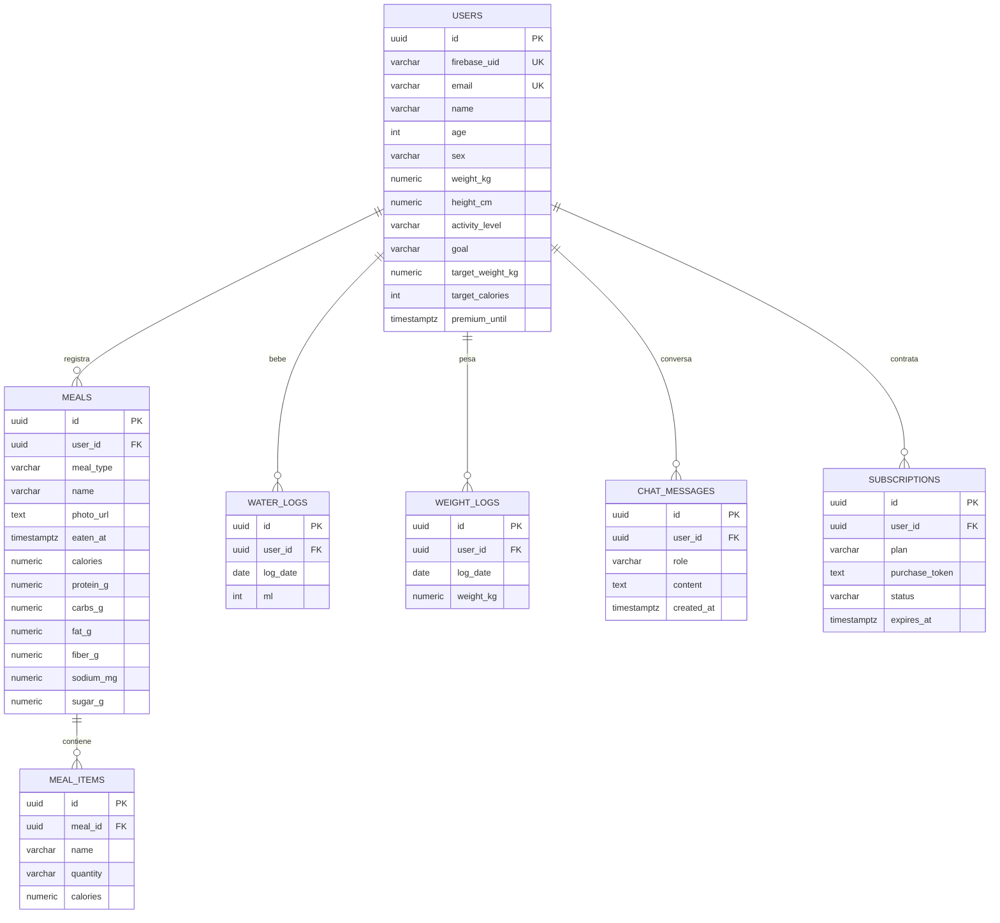

# Base de Datos — NutriScan AI
PostgreSQL 16 · migraciones con Flyway (`backend/src/main/resources/db/migration`)

## Modelo entidad-relación

## Decisiones de diseño
- **UUID** como PK (generación distribuida, no enumerable desde fuera — seguridad).
- Totales nutricionales **desnormalizados en `meals`**: el dashboard y las estadísticas se resuelven sin agregar `meal_items` (rendimiento con millones de filas).
- Índices por patrones de acceso reales: `meals(user_id, eaten_at DESC)`, `water_logs(user_id, log_date)`, `chat_messages(user_id, created_at)`.
- `ON DELETE CASCADE` desde `users`: la eliminación de cuenta borra todos los datos personales (requisito de privacidad).
- Restricciones `CHECK` en enums y rangos fisiológicos: defensa en profundidad además de la validación de la API.
