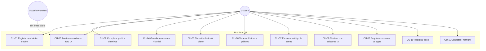

# Casos de Uso — NutriScan AI

## Diagrama general

## CU-03 — Analizar comida con foto IA (detalle)

| Campo | Descripción |
|---|---|
| Actor | Usuario autenticado |
| Precondición | Sesión activa; cámara o galería disponible |
| Flujo principal | 1. El usuario abre la cámara IA. 2. Fotografía el plato o elige imagen de galería. 3. La app envía la imagen a `POST /meals/analyze`. 4. El backend verifica la cuota (gratuito: N/día). 5. El proveedor de visión detecta plato, ingredientes y porciones. 6. Se muestran calorías y macros con desglose por ingrediente. 7. El usuario elige tipo de comida y guarda. |
| Flujo alternativo A | 4a. Cuota agotada → HTTP 402 y se ofrece Premium. |
| Flujo alternativo B | 5a. La imagen no contiene comida → mensaje "No se detectó comida". |
| Postcondición | Comida guardada en historial con totales recalculados |

## CU-01 — Registrarse / Iniciar sesión

| Campo | Descripción |
|---|---|
| Actor | Visitante |
| Flujo principal | 1. Elige Google, Apple o email. 2. Firebase autentica y entrega ID token. 3. La app lo canjea en `POST /auth/login`. 4. El backend crea/asocia el usuario y emite JWT (access+refresh). 5. Si el perfil está incompleto se redirige al setup (CU-02). |
| Alternativo | Recuperación de contraseña por correo (Firebase). |

## CU-11 — Contratar Premium

| Campo | Descripción |
|---|---|
| Actor | Usuario autenticado |
| Flujo principal | 1. Abre pantalla Premium. 2. Elige plan mensual o anual. 3. Google Play Billing procesa la compra. 4. La app envía el purchase token a `POST /subscriptions/verify`. 5. El backend valida contra Google Play y activa `premiumUntil`. |
| Postcondición | Análisis IA ilimitados, chat ilimitado, reportes, sin anuncios |

*Los casos CU-05 a CU-10 siguen la misma plantilla: petición autenticada, validación en servicio de aplicación, persistencia en PostgreSQL y respuesta DTO.*
