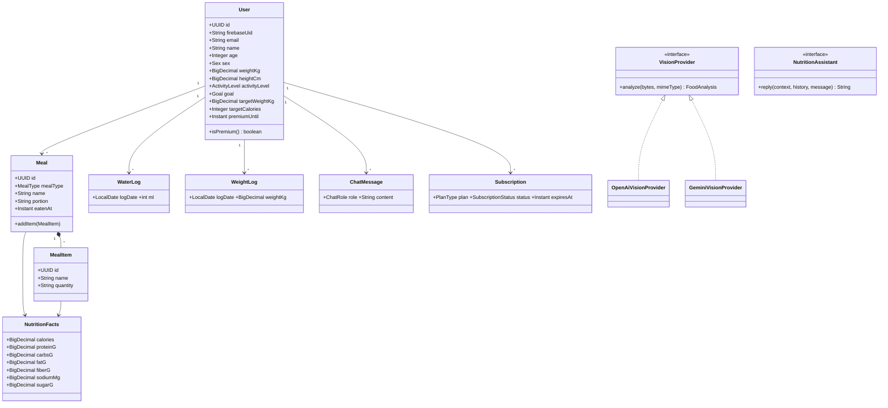
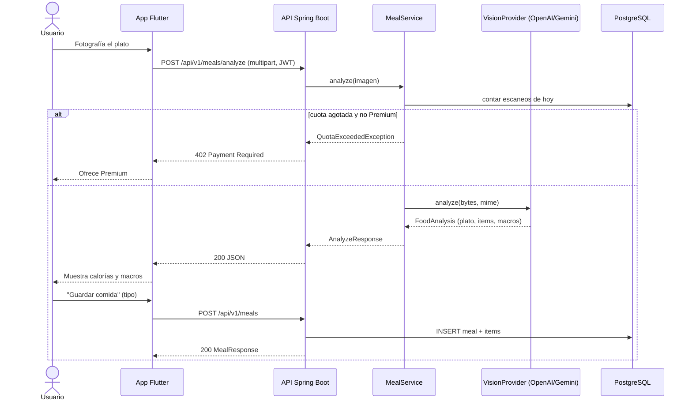
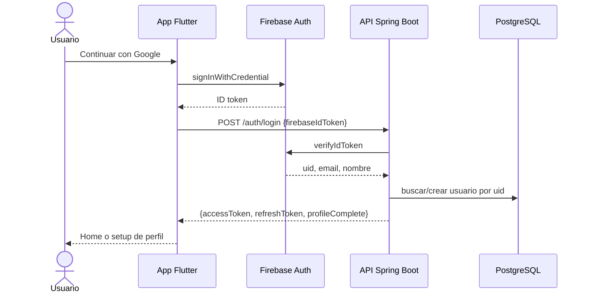

# Diagramas UML — NutriScan AI

## Diagrama de clases (dominio del backend)

```mermaid
classDiagram
    class User {
      +UUID id
      +String firebaseUid
      +String email
      +String name
      +Integer age
      +Sex sex
      +BigDecimal weightKg
      +BigDecimal heightCm
      +ActivityLevel activityLevel
      +Goal goal
      +BigDecimal targetWeightKg
      +Integer targetCalories
      +Instant premiumUntil
      +isPremium() boolean
    }
    class Meal {
      +UUID id
      +MealType mealType
      +String name
      +String portion
      +Instant eatenAt
      +addItem(MealItem)
    }
    class MealItem {
      +UUID id
      +String name
      +String quantity
    }
    class NutritionFacts {
      +BigDecimal calories
      +BigDecimal proteinG
      +BigDecimal carbsG
      +BigDecimal fatG
      +BigDecimal fiberG
      +BigDecimal sodiumMg
      +BigDecimal sugarG
    }
    class WaterLog { +LocalDate logDate +int ml }
    class WeightLog { +LocalDate logDate +BigDecimal weightKg }
    class ChatMessage { +ChatRole role +String content }
    class Subscription { +PlanType plan +SubscriptionStatus status +Instant expiresAt }

    class VisionProvider {
      <<interface>>
      +analyze(bytes, mimeType) FoodAnalysis
    }
    class NutritionAssistant {
      <<interface>>
      +reply(context, history, message) String
    }
    class OpenAiVisionProvider
    class GeminiVisionProvider

    User "1" --> "*" Meal
    User "1" --> "*" WaterLog
    User "1" --> "*" WeightLog
    User "1" --> "*" ChatMessage
    User "1" --> "*" Subscription
    Meal "1" *-- "*" MealItem
    Meal --> NutritionFacts
    MealItem --> NutritionFacts
    VisionProvider <|.. OpenAiVisionProvider
    VisionProvider <|.. GeminiVisionProvider
```

## Diagrama de secuencia — Análisis de comida con IA

```mermaid
sequenceDiagram
    actor U as Usuario
    participant APP as App Flutter
    participant API as API Spring Boot
    participant SVC as MealService
    participant VP as VisionProvider (OpenAI/Gemini)
    participant DB as PostgreSQL

    U->>APP: Fotografía el plato
    APP->>API: POST /api/v1/meals/analyze (multipart, JWT)
    API->>SVC: analyze(imagen)
    SVC->>DB: contar escaneos de hoy
    alt cuota agotada y no Premium
        SVC-->>API: QuotaExceededException
        API-->>APP: 402 Payment Required
        APP-->>U: Ofrece Premium
    else
        SVC->>VP: analyze(bytes, mime)
        VP-->>SVC: FoodAnalysis (plato, items, macros)
        SVC-->>API: AnalyzeResponse
        API-->>APP: 200 JSON
        APP-->>U: Muestra calorías y macros
        U->>APP: "Guardar comida" (tipo)
        APP->>API: POST /api/v1/meals
        API->>DB: INSERT meal + items
        API-->>APP: 200 MealResponse
    end
```

## Diagrama de secuencia — Autenticación

```mermaid
sequenceDiagram
    actor U as Usuario
    participant APP as App Flutter
    participant FB as Firebase Auth
    participant API as API Spring Boot
    participant DB as PostgreSQL

    U->>APP: Continuar con Google
    APP->>FB: signInWithCredential
    FB-->>APP: ID token
    APP->>API: POST /auth/login {firebaseIdToken}
    API->>FB: verifyIdToken
    FB-->>API: uid, email, nombre
    API->>DB: buscar/crear usuario por uid
    API-->>APP: {accessToken, refreshToken, profileComplete}
    APP-->>U: Home o setup de perfil
```
